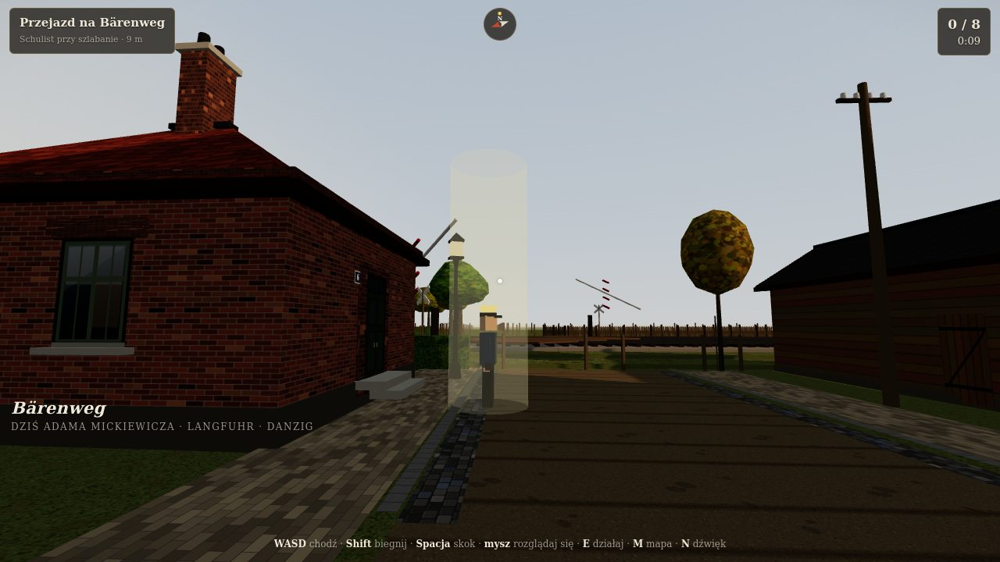
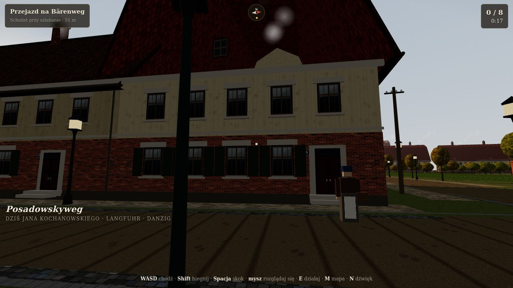
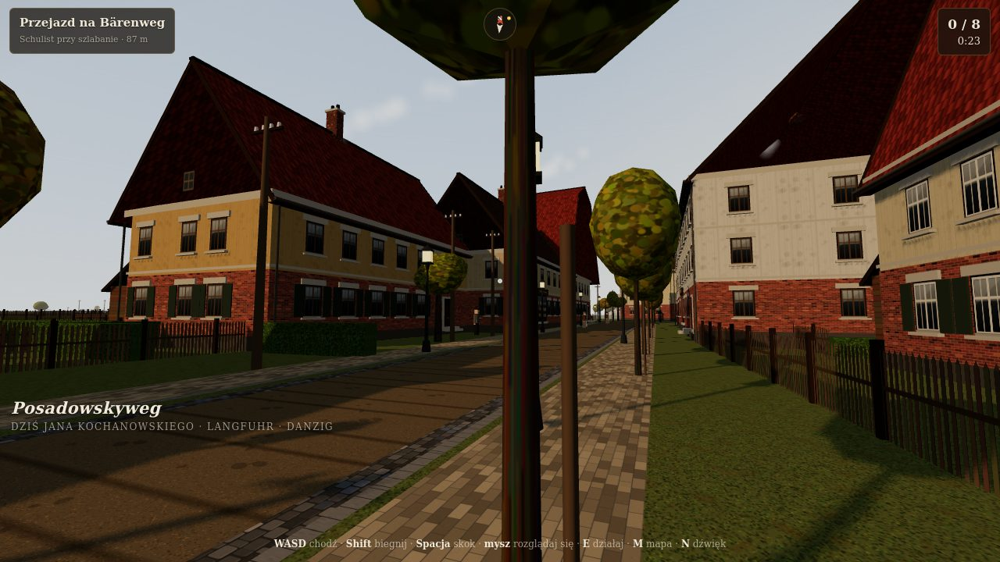
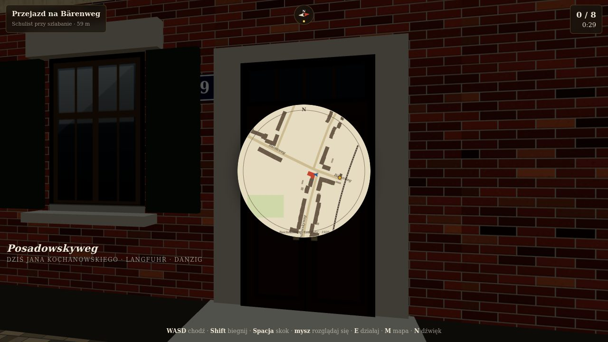
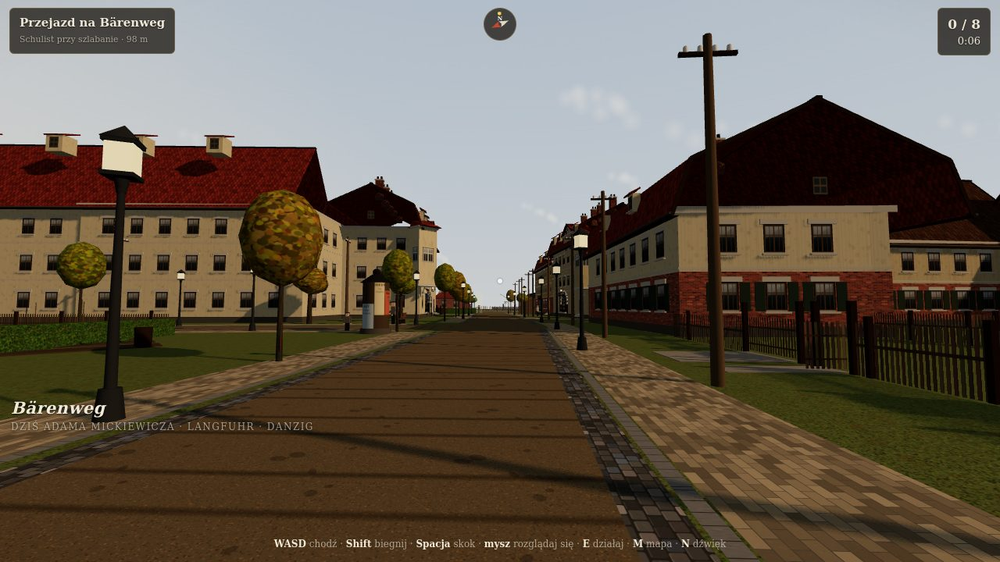
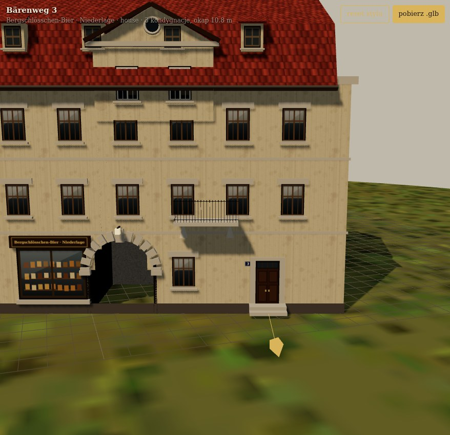

# Gdańsk Kolonia — the Reichskolonie, Danzig-Langfuhr, 15 November 1920

**A hundred and fifty metres of a real Gdańsk neighbourhood as it was on the day the Free City of Danzig was proclaimed, as a first-person game in the browser.** Plain [Three.js](https://threejs.org), no game engine, no downloaded models, no sound files: every house, fence, gas lamp, garden bed, the railway, the horse cart, the people and every sound are generated by code in this repo from open data and from the historical research in `research/`.

Live: **https://kolonia.lakis.pro** — phone (stick + drag to look, buttons to jump / sprint / act) or desktop (WASD, mouse, Space, Shift, E).

| | |
|---|---|
|  |  |
| **Bärenweg at the railway** — the Bahnwärter's house (Bärenweg 6, Schulist), the raised barrier, the cross-buck; you arrive here from the shift | **Bärenweg 9** — the colony corner house where Potrafki lives: brick ground floor, plastered upper storey, green shutters, mansard roof with roof windows |
|  |  |
| **Posadowskyweg** (today's Kochanowskiego, which kept its 1910 numbers) — the co-operative rows, sand roadway between granite kerbs, staked saplings, gas lamps | **M / mapa** — the 1920 plan with the German street names, the railway, the sports ground, you, and the next objective |
|  |  |
| **Bärenweg at the Posadowskyweg junction** — the two corner blocks of the postcard, seen from the Marktplatz | **Bärenweg 3** — the beer depot's shop sign, the round-arched carriage passage, the balcony and the wall dormer |

## The game

Monday, 15 November 1920, after the shift. You are **Franciszek Potrafki**, riveter at the **Danziger Werft** (the former Imperial Shipyard, handed to the city a year earlier), living at **Bärenweg 9** in the **Reichskolonie** — the housing colony the Imperial Naval Office built in 1907–1915 for the yard's workers, run by the Wohnungsgenossenschaft Neuschottland. Today the Constituent Assembly proclaimed the Free City. Eight things stand between the level crossing and your soup:

1. the crossing keeper Schulist and the news from the Assembly;
2. bread on the ration card at Alt's bakery (rye 1.80 M/kg or wheat 3 M);
3. butter on the card, or margarine without, at Frau Schwarz's dairy;
4. Wollermann the union man at his door — the Volksstimme puts "Freiheit" in quotation marks, and there is a tariff meeting tonight;
5. a newsboy at the advertising column with the Volksstimme (25 Pf);
6. Kossowski digging the last potatoes on the Marktplatz garden strips;
7. your children on the sand of Posadowskyweg, Jaś with a new zinc 10-Pfennig coin;
8. home, and Agnieszka.

Some steps are choices; the end card totals what is left of the 180 Mark from Saturday's pay. Walk, sprint, **jump over the picket fences and hedges** (walls and the railway embankment stay solid), read the enamel street signs, listen: wind, rooks, a dog, the church bell, riveting and a steam whistle from the yard to the south-east, a train on the Neufahrwasser line, hooves and iron tyres when the coal cart passes, your own boots on sand, clinker and boards.

Controls — phone: left stick walks, drag anywhere else to look, **skok** jumps, **bieg** toggles sprint, **działaj** acts, **mapa**, **dźwięk**. Desktop: **WASD**, mouse (click to lock), **Space**, **Shift**, **E**, **M**, **N** sound, **F1** stats, **R** back to the start.

## What is real here

| layer | source | how it is used |
|---|---|---|
| the neighbourhood, who lived where, what things cost | `research/history.md` — Adreßbuch für Danzig und Vororte 1920 (Pomorska Biblioteka Cyfrowa), Gedanopedia, Danziger Volksstimme 1920 (FES library), *Moderne Bauformen* 1910, period postcards, the 1920 Danzig chronicle | the story, the names on the doors (Schulist, Alt, Schwarz, Wollermann, Kossowski, Potrafki, Trohl are all 1920 residents of these streets), the prices and the dialogue |
| which buildings stood in 1920 | **Plan der Stadt Danzig 1920** and **1933** (Städtisches Vermessungsamt, 1:10 000, mapywig/Mapster), georeferenced to the present-day block in `research/maps/`, checked against the address book | the two-storey co-operative rows of Posadowskyweg 61–113, the Bärenweg corner houses and the Marineweg rows are kept; the 3–4-storey blocks on the south side of Bärenweg (today's Mickiewicza 27–43, the origin among them) were built 1921–33 and are replaced by the building plots and gardens of 1920; garages, post-war blocks and the kindergarten are removed |
| footprints, addresses, streets, the railway | [OpenStreetMap](https://www.openstreetmap.org/copyright) via Overpass, 240 m around Mickiewicza 43 | `public/data/osm.json` → `tools/build_scene.py` → `public/data/scene.json`; Reja (Leegstrieß) and Dzielna (Simsonweg) did not exist in 1920 and are left out |
| building heights | [GUGiK Budynki 3D LOD1 2024](https://www.geoportal.gov.pl/en/data/other-data/3d-models-of-building/) (powiat m. Gdańsk), airborne-LiDAR solids | 85 of 140 buildings carry a measured height |
| plot boundaries | EGiB cadastral parcels via the GUGiK ULDK service (165 parcels) | picket fences, iron railings on brick dwarf walls, hedges and gates on the real property lines |
| relief | GUGiK NMT (digital terrain model), 10 m grid over 500 m | the gentle fall from ~6.5 m ASL in the west to ~4 m by the railway; everything sits on it |
| trees | canopy blobs from the GUGiK orthophoto, thinned; young staked street trees and the estate's orchards from the 1910 photographs and the 1908 survey | |
| the two corner blocks at the junction | the postcard "Reichskolonie Dzg.-Langfuhr · Bärenweg" (J. Wasielewski's collection) | Bärenweg 3 and 10f are modelled from it: three plastered storeys over a tall shop floor, a round-arched carriage passage with voussoirs and a keystone, a gabled wall dormer (Zwerchhaus) with a round window, a row of hooded dormers in the mansard, a projecting corner bay and an iron balcony |
| the look of the houses | the 1910 photographs of Posadowskyweg 82–86 and 99 (Paul Kadereit, *Moderne Bauformen*), the postcards, present-day details | brick ground floors and surrounds, light plaster, wooden shutters, mansard and gabled roofs with roof windows, picket fences, sand roadways, gas lamps |

Coordinates are local metres around the Mickiewicza 43 centroid, `54.3825003 N 18.6262664 E` (`public/data/config.json`); EPSG:2180 ↔ WGS84 is in `tools/geo.py`. Street names on the signs and the map are the 1920 ones: Bärenweg (Mickiewicza), Posadowskyweg (Kochanowskiego), Marineweg (Klonowicza), Neptunweg (Sochaczewska).

Honest limits: the exact 1920 house numbers of the Bärenweg (renumbered in the mid-1920s) are not documented, so the corner houses carry plausible ones (9, 10f, 49, 4, 5, 7); window layouts, shutters and roof windows are generated, not counted from photographs; the mottoes and fish reliefs of the real façades are not modelled; the railway halt "Danzig-Reichskolonie", the Christuskirche and the Strießbach lie outside the 150 m and are only heard or mentioned.

## The building panel

**https://kolonia.lakis.pro/admin** — one generated building at a time in an orbit viewer (drag to rotate, wheel or pinch to zoom), with its facts (OSM id, today's address, LiDAR height, what stood there in 1920), the 1910 reference photographs, and three things you can do:

- **edit the style record** (JSON) and *zastosuj* — storeys, roof kind (`gable`, `hip`, `mansard`, `flat`), pitch, wall (`brick_red`, `brick_yellow`, `wall_white`, `wall_cream`, `wall_ochre`, `wall_sand`, `wall_olive`, `wall_rose`, `wall_grey`, `wall_green`), `brickBase`, `shutters`, `dormers`, `roof` (`red`, `brown`, `orange`, `dark`, `slate`, `tar`), `shop` text, `number` on the plate — a preview only, until it is written into `public/data/overrides.json` (keyed by building id), which both the game and the panel merge over the generated styles;
- **write instructions** and *zapisz notatkę* — stored by `tools/notes_server.py` (container `kolonia-admin`) in `admin/notes.json`, which is where the next refinement round starts;
- **pobierz .glb** — the building as shown, exported with Three's `GLTFExporter` (binary glTF 2.0 with the baked textures), ready for Unity, Unreal, Godot or Blender.

## Layout

| path | what |
|---|---|
| `research/history.md` | the historical report (streets, residents, chronology, daily life, architecture, sources) |
| `research/maps/` | the georeferenced 1920 and 1933 plans, overlays, the terrain sampler, `buildings1920.json` (automatic verdicts; the final verdicts are the rules in `src/world/plan1920.js`) |
| `tools/build_scene.py`, `lod1_extract.py`, `fetch_parcels.py`, `veg_from_ortho.py`, `geo.py` | the data pipeline |
| `src/world/plan1920.js` | **the plan of 1920**: which buildings, their styles, the streets, the gardens, orchards, pitch, railway and crossing, the people and the eight chapters |
| `src/kit/tenement.js` | the building generator: rectangle decomposition (bent rows are sliced along the frontage, or a hero building carries its own massing in `style.rects`), gable / hip / mansard roofs, carriage archways cut through the wall, wall dormers, corner bays, balconies, brick bases, shutters, dormers, shop fronts, doors |
| `src/kit/people.js` | the people and the horse cart |
| `src/world/` | collision world (obstacles have heights, so fences can be vaulted), streets, plots, vegetation, `props1920.js` (gas lamps, telegraph poles, enamel signs, the Litfaßsäule, pumps, benches, garden strips, orchards, the sports ground, the railway, the level crossing) |
| `src/core/` | player (walk, sprint, jump, touch), materials, Canvas2D textures, baker (merges everything per material and lifts it onto the terrain), minimap, `audio.js` (all sounds synthesised with the Web Audio API) |
| `src/game/story.js` | the chapter engine with dialogue cards and choices |
| `tools/capture.mjs`, `tools/playtest.mjs`, `tools/views.json` | Playwright: fixed viewpoints and an end-to-end run |

## Run it

```bash
npm install
npm run dev          # http://127.0.0.1:5180
npm run build        # dist/  (what kolonia.lakis.pro serves)
npm run preview      # http://127.0.0.1:5181
node tools/capture.mjs http://127.0.0.1:5181 && node tools/playtest.mjs http://127.0.0.1:5181
```

Regenerating the data needs Python 3 with numpy, PIL and scipy; the LoD1 sheets and the orthophoto go in `ref/` (not committed).

## QA

`tools/playtest.mjs` drives the built app in a touch-emulated Pixel 7: taps *Wejdź*, walks with the stick, jumps, toggles sprint, teleports to each of the eight chapters, presses *działaj*, answers the card, and checks the end card. Last run: **8/8 chapters, walk 2.7 m/s, jump 0.8 m at 5 frames, no page errors, 104 draw calls, 286 k triangles**.

## License

Code: MIT. Geometry © OpenStreetMap contributors (ODbL). Building heights, parcels and terrain: GUGiK open data (CC BY 4.0). The historical maps, photographs and the address book scans are not redistributed; their sources are listed in `research/history.md` and `research/maps/README.md`.
